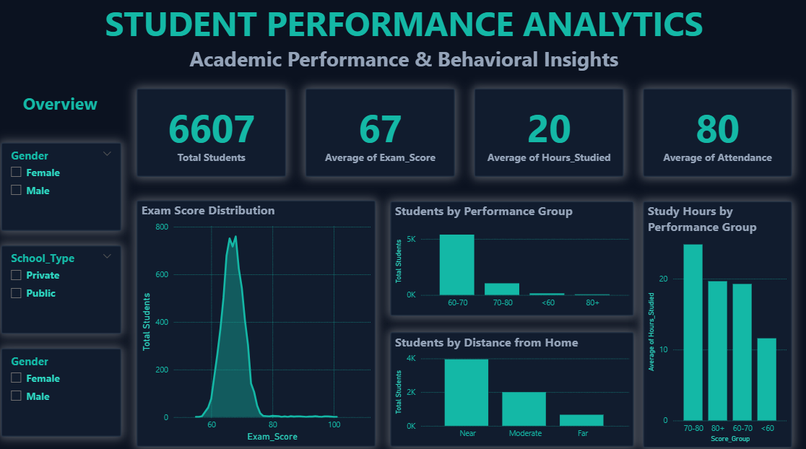
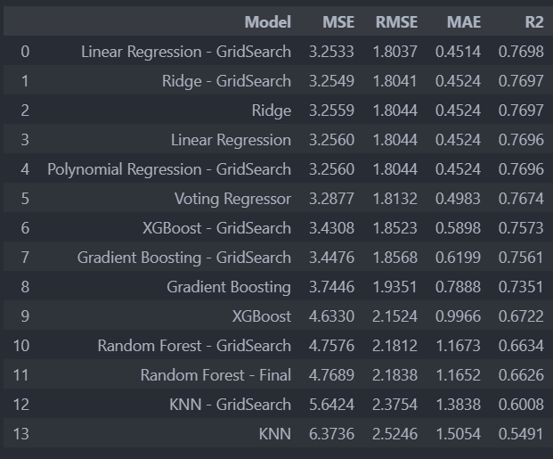
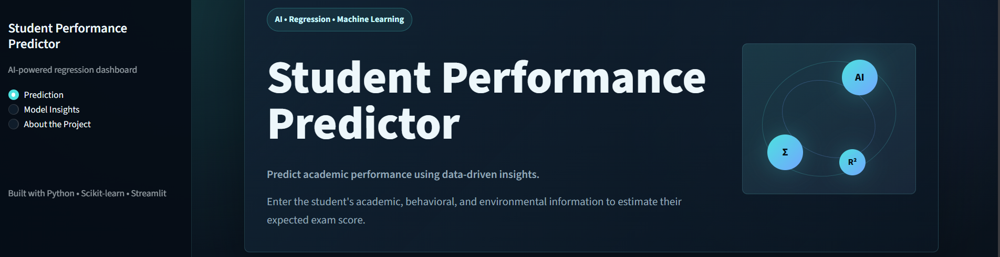
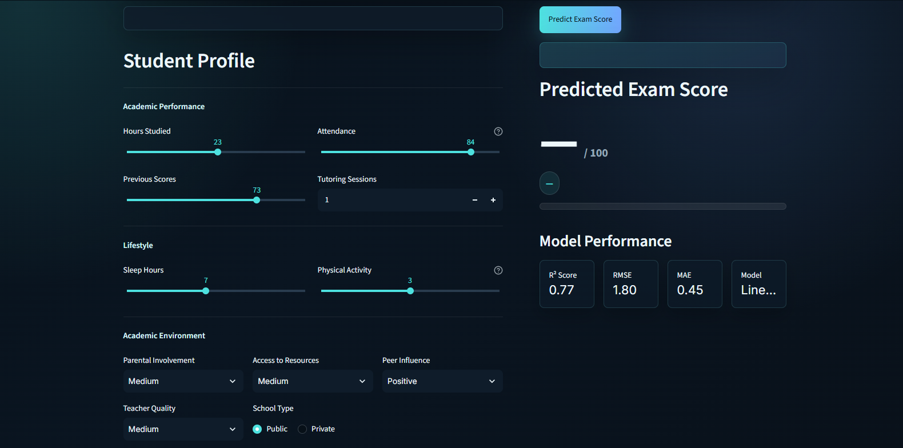
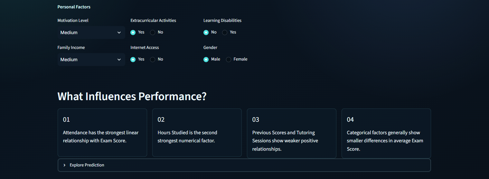
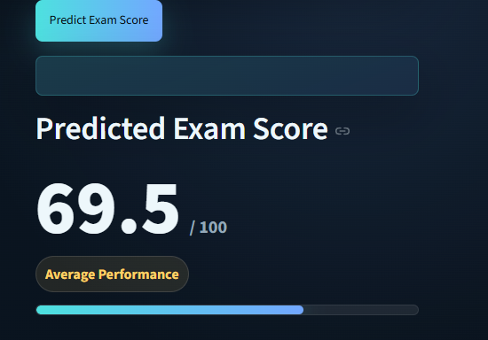

<div align="center">


</div>

---

# 📌 Project Overview

An end-to-end **Data Science / Machine Learning** case study that moves from raw student records to a deployed prediction tool:

**Data Analysis → Machine Learning → Business Intelligence → Deployment**

The goal is to analyze academic, behavioral, lifestyle, and environmental factors related to student performance, and build a regression model capable of predicting `Exam_Score` — then surface the findings through an interactive Power BI dashboard and a live Streamlit application.

```python
project = {
    "dataset": "Student Performance Factors",
    "records": 6607,
    "target": "Exam_Score",
    "problem_type": "Regression",
    "dashboard_pages": 3,
    "deployment": "Streamlit",
    "final_model": "Linear Regression",
    "r2_score": 0.77
}
```

---

# 🎯 Project Objectives

- Understand which factors are most associated with `Exam_Score`
- Perform Exploratory Data Analysis (EDA) on academic and lifestyle features
- Compare multiple regression models under a consistent evaluation pipeline
- Select the best-performing model based on test metrics
- Analyze model errors and limitations through residual analysis
- Build a 3-page interactive Power BI dashboard
- Deploy the final model as a live Streamlit application

---

# 🗂️ Dataset

| | |
|---|---|
| **Records** | 6,607 students |
| **Target variable** | `Exam_Score` |
| **Problem type** | Regression |

**Numerical features**

| Feature | Description |
|---|---|
| `Hours_Studied` | Weekly hours spent studying |
| `Attendance` | Attendance percentage |
| `Previous_Scores` | Prior academic score |
| `Tutoring_Sessions` | Number of tutoring sessions attended |
| `Sleep_Hours` | Average hours of sleep |
| `Physical_Activity` | Physical activity level |

**Categorical features**

| Feature | Description |
|---|---|
| `Parental_Involvement` | Level of parental involvement |
| `Access_to_Resources` | Access to learning resources |
| `Motivation_Level` | Student's motivation level |
| `Family_Income` | Household income bracket |
| `Teacher_Quality` | Perceived teacher quality |
| `School_Type` | Public / Private |
| `Peer_Influence` | Positive / neutral / negative |
| `Learning_Disabilities` | Yes / No |
| `Internet_Access` | Yes / No |
| `Extracurricular_Activities` | Yes / No |
| `Gender` | Male / Female |

Together, these span **academic behavior, attendance, study habits, tutoring, lifestyle, family environment, school environment,** and **personal characteristics.**

---

# 🔍 Exploratory Data Analysis

Correlation of numerical features with `Exam_Score`:

| Feature | Correlation |
|---|---|
| `Attendance` | **0.581** |
| `Hours_Studied` | **0.445** |
| `Previous_Scores` | 0.175 |
| `Tutoring_Sessions` | 0.157 |
| `Physical_Activity` | 0.028 |
| `Sleep_Hours` | -0.017 |

**Key observations**

- `Attendance` shows the strongest numerical relationship with `Exam_Score`, followed by `Hours_Studied`.
- `Previous_Scores` and `Tutoring_Sessions` show weaker, positive relationships.
- `Physical_Activity` and `Sleep_Hours` show very little linear relationship with exam performance.
- Categorical factors (parental involvement, access to resources) show comparatively smaller differences in average `Exam_Score` across categories.

> These are **correlations / associations**, not evidence of causation.

---

# 📊 Power BI Dashboard

A 3-page interactive dashboard was built to explore the dataset beyond the notebook.

The editable Power BI file is included in the repository:

`dashboard/dashboard.pbix`

## 📋 Page 1 — Overview

High-level snapshot of the full student population.

- **KPIs:** Total Students (6,607), Average `Exam_Score`, Average `Hours_Studied`, Average `Attendance`
- **Exam Score Distribution** — density chart showing scores concentrated in the 60–75 range
- **Students by Performance Group** and **Students by Distance from Home**
- **Study Hours by Performance Group**
- Filters: Gender, School Type



## 🎯 Page 2 — Performance Drivers

Focused view of the factors most linked to exam performance.

- **Study Hours vs Exam Score** and **Attendance vs Exam Score** scatter plots
- **Score by Access to Resources** and **Score by Parental Involvement** bar charts
- **Attendance Correlation (0.581)** and **Hours Studied Correlation (0.445)** callouts
- Filters: Gender, School Type


## 👨‍🎓 Page 3 — Student Segmentation

Breaks students into performance groups and compares behavior across them.

- Segments: **`<60` · `60–70` · `70–80` · `80+`**
- **Attendance**, **Previous Scores**, and **Study Hours by Performance Group**
- **Study Hours vs Previous Scores** (colored by score group) and **Exam Score Trend by Attendance**
- The `70–80` group shows the strongest averages across attendance, study hours, and previous scores; the `80+` group is a much smaller segment and doesn't uniformly follow the same pattern.


---

# 🤖 Machine Learning

This is framed as a **supervised regression problem**, predicting a continuous `Exam_Score`.

```text
Raw Data
   ↓
Data Cleaning
   ↓
Train / Test Split
   ↓
Preprocessing (ColumnTransformer → StandardScaler + OneHotEncoder)
   ↓
Regression Models (Pipeline)
   ↓
Cross Validation
   ↓
Hyperparameter Tuning
   ↓
Evaluation
   ↓
Final Model
   ↓
Deployment
```

Numerical features were scaled with `StandardScaler` and categorical features encoded with `OneHotEncoder`, combined through a `ColumnTransformer` inside a scikit-learn `Pipeline` for consistent preprocessing across training and inference.

---

# 🧠 Models Evaluated

| Model |
|---|
| Linear Regression |
| Ridge Regression |
| K-Nearest Neighbors (KNN) |
| Random Forest |
| Gradient Boosting |
| XGBoost |
| Voting Ensemble |

---

# 📈 Model Comparison

| Model | MSE | RMSE | MAE | R² |
|---|---|---|---|---|
| **Linear Regression** ⭐ | 3.2533 | 1.8037 | 0.4514 | **0.7698** |
| Ridge | 3.2549 | 1.8041 | 0.4524 | 0.7697 |
| Voting Ensemble | 3.2877 | 1.8132 | 0.4983 | 0.7674 |
| XGBoost | 3.4308 | 1.8523 | 0.5898 | 0.7573 |
| Gradient Boosting | 3.7446 | 1.9351 | 0.7888 | 0.7351 |
| Random Forest | 4.7689 | 2.1838 | 1.1652 | 0.6626 |
| KNN | 5.6424 | 2.3754 | 1.3838 | 0.6008 |

**Linear Regression achieved the best overall test performance** among the evaluated models, with **R² ≈ 0.77**, and was selected as the final model. Ridge and the Voting Ensemble followed closely behind, while tree-based ensembles and KNN trailed on both R² and error metrics.



---

# 🔬 Model Diagnostics

With R² ≈ 0.77, the final model explains most — but not all — of the variance in `Exam_Score`. Because scores are heavily concentrated in the 60–75 range, students with `Exam_Score` above 80 are rare in the dataset, and the model tends to **underpredict this small group of high-performing students**, producing larger positive residuals for those cases.

Diagnostic views used to evaluate this:

- Actual vs Predicted
- Residuals vs Predicted
- Residual Distribution
- Q-Q Plot
- Error analysis by Score Group

This is treated as a **data-coverage limitation** rather than a flaw specific to Linear Regression — the model performs reliably for the bulk of students, with reduced confidence at the rare, high-scoring tail of the distribution.

---

# 🚀 Streamlit Deployment

The trained preprocessing pipeline and regression model were saved as `student_performance_model.pkl` with Joblib and integrated into a Streamlit application for real-time predictions.

```text
Student Inputs
     ↓
Preprocessing
     ↓
Trained Model
     ↓
Predicted Exam Score
```

## 🏠 Application Interface

Landing view of the AI-powered regression dashboard, with navigation between **Prediction**, **Model Insights**, and **About the Project**.



## 📊 Application Analytics

Student profile inputs — academic performance, lifestyle, and academic environment fields — feeding the prediction pipeline.



## 🎯 Prediction

Model performance is displayed alongside each prediction (R² Score, RMSE, MAE, and the model used).



## 📈 Additional View

Predicted Exam Score output, shown out of 100 with a performance indicator.



**App features:**

- Student information inputs
- Automated feature processing
- Exam score prediction
- Model performance display
- Clean, interactive UI

---

# 💡 Key Insights

| # | Insight |
|---|---|
| 1 | Attendance has the strongest numerical correlation with Exam Score (0.581). |
| 2 | Hours Studied has the second strongest numerical relationship (0.445). |
| 3 | Most students are concentrated in the 60–70 score group. |
| 4 | The 80+ score group is a very small segment of the dataset. |
| 5 | Linear Regression performed best among all evaluated models (R² ≈ 0.77). |
| 6 | The model underpredicts a small group of high-performing students. |
| 7 | The final model was successfully deployed through a live Streamlit application. |

---

# 🛠️ Technologies

### Data Analysis
Python · Pandas · NumPy

### Machine Learning
Scikit-learn · XGBoost

### Visualization / BI
Power BI · Matplotlib / Seaborn (notebook EDA)

### Deployment
Streamlit · Joblib

### Development
Jupyter Notebook

---

# 📁 Project Structure

```text
student-performance-prediction/
│
├── app/
│   ├── app.py
│   └── student_performance_model.pkl
│
├── dashboard/
│   └── dashboard.pbix
│
├── data/
│   └── StudentPerformanceFactors.csv
│
├── notebook/
│   └── notebook.ipynb
│
├── assets/
│   ├── models.png
│   ├── overview.png
│   ├── performace deivers.png
│   ├── student seg.png
│   ├── streamlit_1.png
│   ├── streamlit_2.png
│   ├── streamlit_3.png
│   └── streamlit_predect.png
│
└── README.md
```

# 🔄 End-to-End Workflow

```text
Student Data
     ↓
Data Cleaning
     ↓
EDA
     ↓
Feature Analysis
     ↓
Power BI Dashboard
     ↓
ML Preprocessing
     ↓
Model Comparison
     ↓
Model Evaluation
     ↓
Residual Analysis
     ↓
Final Model
     ↓
Streamlit Deployment
     ↓
Exam Score Prediction
```

---

<div align="center">

### From raw student data to actionable insight — analyzed, modeled, and deployed as a working application.

**Built by Mahmoud**

</div>
